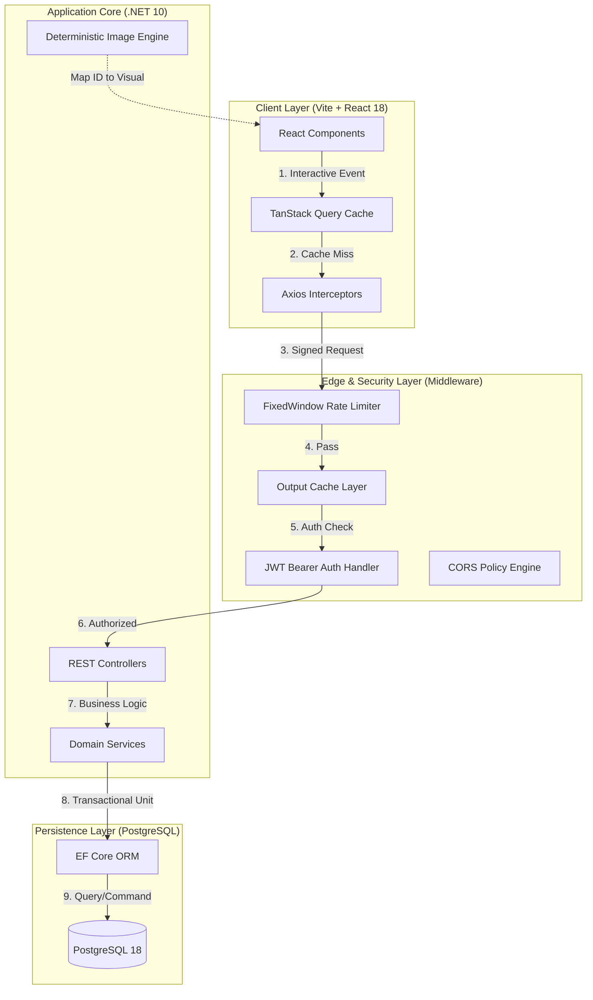
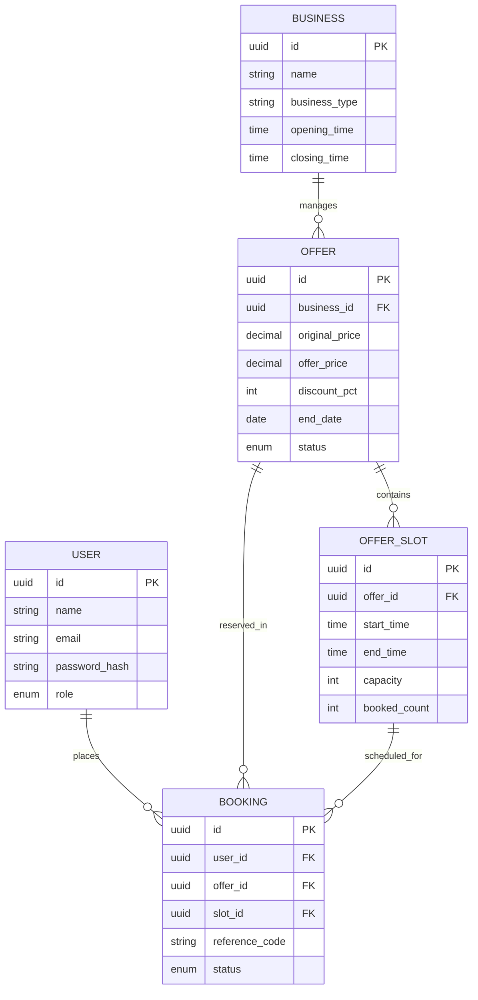
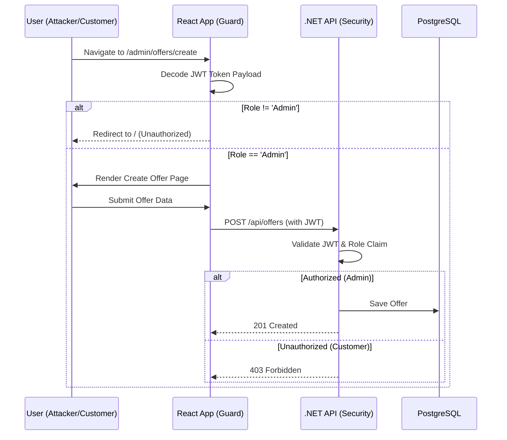
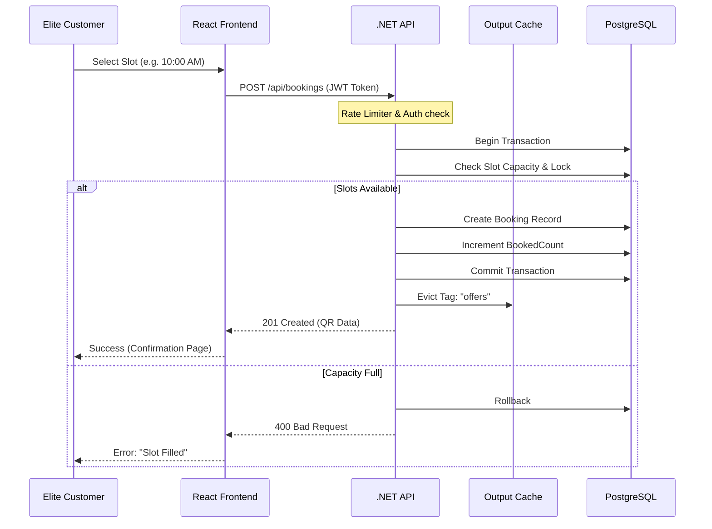
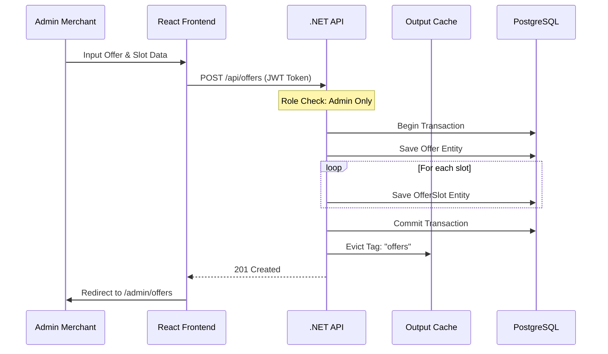
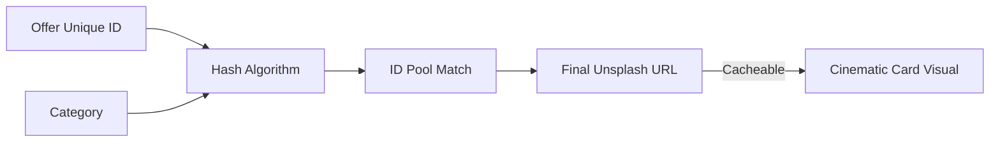

# 🏆 SmartOffer: Enterprise-Grade Elite Slot Booking System

[](https://github.com/)
[](https://dotnet.microsoft.com/)
[](https://reactjs.org/)
[](https://tailwindcss.com/)

**SmartOffer** is a high-performance, fullstack digital marketplace designed for luxury service providers to manage exclusive, time-bound offers. Built with the **Awwwards Standard** of visual excellence and powered by an enterprise-grade .NET backend.

---

## 🏛️ Comprehensive System Architecture

### **1. Multilayered Infrastructure Diagram**
This diagram illustrates the request journey from the edge down to the persistent storage, highlighting the performance and security middleware.



### **2. Entity Relationship Diagram (ERD)**
Detailed schema mapping showing the relational integrity and foreign key constraints enforced by Entity Framework Core.



### **3. RBAC Security Sequence**
Ensures that access control is enforced at both the UI layer (via JWT decoding) and the API layer (via Role-based claims).



---

## 🔄 Critical Workflow Orchestration

### **1. Secure Reservation Workflow (Transactional)**
This sequence demonstrates how the system maintains data integrity under load, ensuring no overbooking occurs.



### **2. New Offer & Slot Orchestration**
Transactional integrity for merchant content creation, ensuring slots are never orphaned.



### **3. Deterministic Image Hashing Logic**
To ensure an "Awwwards" aesthetic without heavy backend processing or duplicate visuals, we use a deterministic client-side engine.



---

## 🛠️ Comprehensive API Reference

### **Authentication & RBAC**
| Endpoint | Method | Role | Logic Detail |
| :--- | :--- | :--- | :--- |
| `/api/auth/register` | `POST` | Public | **Strictly `Customer`**. Role escalation via query param is disabled. |
| `/api/auth/login` | `POST` | Public | Returns `RS256` signed JWT. |

### **High-Performance Offer Engine**
| Endpoint | Method | Role | Logic Detail |
| :--- | :--- | :--- | :--- |
| `/api/offers` | `GET` | Public | **Output Cached (60s)**. Tagged for smart eviction. |
| `/api/offers/{id}` | `GET` | Public | Eagerly loads Business & Slot entities. |
| `/api/offers` | `POST` | Admin | Triggers `IOutputCacheStore.EvictByTagAsync("offers")`. |

### **Booking & Analytics**
| Endpoint | Method | Role | Logic Detail |
| :--- | :--- | :--- | :--- |
| `/api/bookings` | `POST` | All | Automated link to `UserId` if claims are present. |
| `/api/customer/bookings`| `GET` | Customer | Filters by `ClaimTypes.NameIdentifier`. |
| `/api/dashboard/summary`| `GET` | Admin | Optimized LINQ aggregation for real-time stats. |

---

## 🚀 Engineering Setup

### **1. Runtimes**
-   **.NET 10 SDK** (Core API)
-   **Node.js v22+** (React/Vite)
-   **PostgreSQL 18** (Relational Store)

### **2. Quick Deployment**
```bash
# Database Setup
createdb smart_offer_booking
cd backend && dotnet ef database update

# Scaling Test Data (Massive Seeder)
python3 seed_massive.py # Generates 100+ unique high-end offers

# Execution
cd backend && dotnet run # Port 5152
cd frontend && npm run dev # Port 5173
```

---

## 💎 Visual Excellence Standards
-   **Glass-morphism:** Utilizes `backdrop-blur-3xl` for high-end refraction.
-   **Animated Background:** Living Mesh Gradient engine with **SVG Film Grain** textures.
-   **Editorial Layout:** 4:5 aspect ratio card systems inspired by **Awwwards E-commerce** showcases.

---
*Developed for the Willovate Hackathon 2026. Designed for the Future.* 🚀🏆
